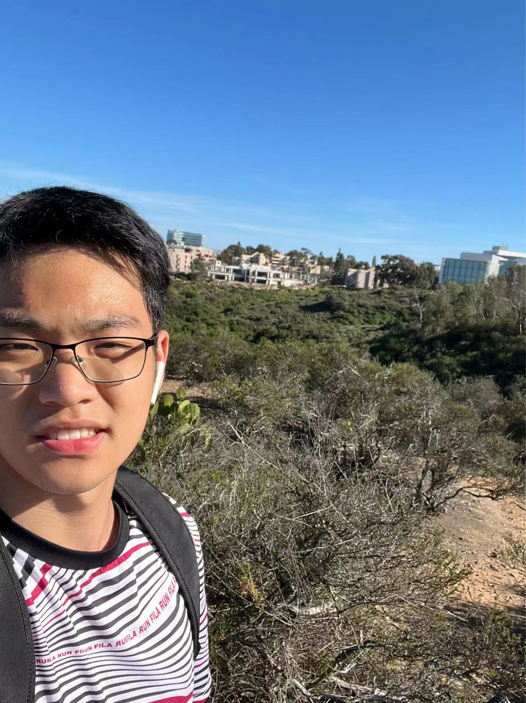

# Hi! Welcomed to Kenry's User Page!
>## Links to each section:
- [Hi! Welcomed to Kenry's User Page!](#hi-welcomed-to-kenrys-user-page)
  - [Self Introduction](#self-introduction)
- [Things I have learned during week 0](#things-i-have-learned-during-week-0)
  - [Github command](#github-command)
  - [dynamic programming](#dynamic-programming)
    - [learning outcome:](#learning-outcome)
  - [Things I will do in next week](#things-i-will-do-in-next-week)
## Self Introduction
>**Basic Info: I am currently a sophomore majoring computer science, to learn more about me, checkout this [relative link](/README.md). And this is a picture of me on a hiking trip &darr;**


*As shown in the picture, I like hiking(most of time individually) a lot since I can always find my peace by wandering in the silence of nature. Besides, I enjoy competitive sports and video games to refresh my mind from intense schoolwork. As a programmer, I like learning various alogrithms and use them to solve interesting quesiton, if you are also into solving fun problems, check out my [leetcode profile](https://leetcode.com/Kenry/) : )*

# Things I have learned during week 0

>A summary of my week 0 
## Github command
*Refamilar myself with github*
* <span style="background-color:cyan">```git add``` </span>
* <span style="background-color:cyan">`git commit`</span>
* <span style="background-color:cyan">`git push` </span>
* <span style="background-color:cyan">`git pull` </span>
* <span style="background-color:cyan">`git status` </span>
* <span style="background-color:cyan">`git clone`</span>

*To learn more about commands and their applications, checkout this [resources](http://guides.beanstalkapp.com/version-control/common-git-commands.html)!*

----

## dynamic programming

**don't compute twice!**

### learning outcome: 
- [ ] Understand Fibonacci sequence and matrix solution 
- [ ] Solve two more relevant problems using different methods

---


## Things I will do in next week

1. attending interesting events
2. preparing for the upcoming quiz
3. exploring advance data struture
4. meeting new friends :)

